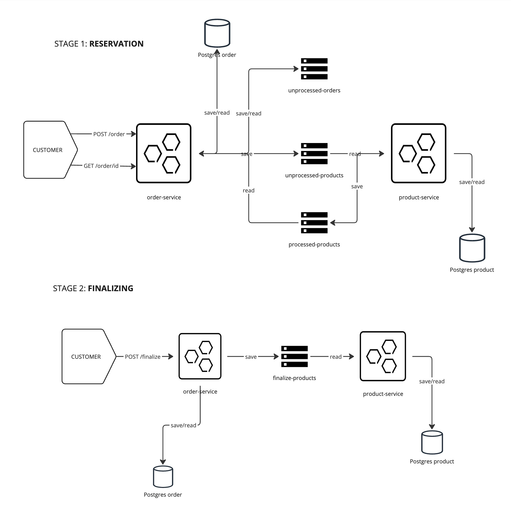
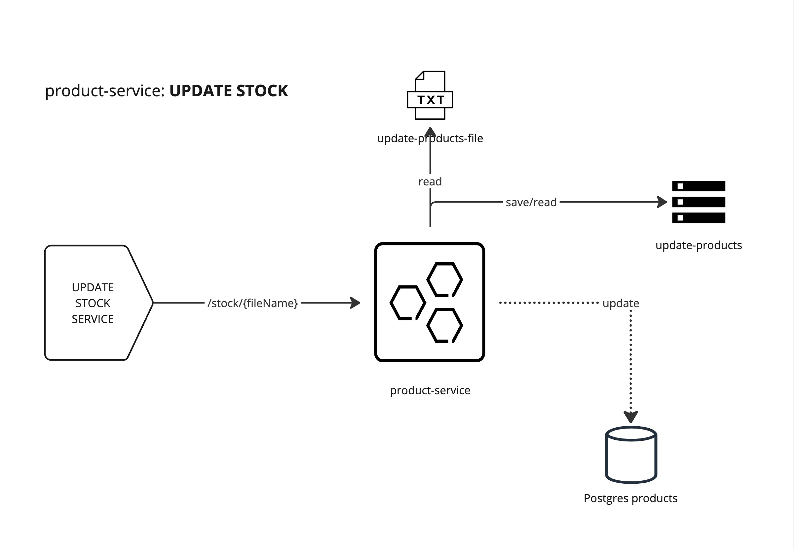

# order-service-app

Order service is a solution that exposes API endpoints which allow customers create order with products and purchase it.
Purpose of the project was to experiment with many technologies and put some concepts into life, rather than create full-featured services.

## Workflow



### Creating an order  
HTTP method: `POST`  
PATH: `/order`  
**Request**  
Content-Type: `application/json`   
Body:
```json
{
    "customerId": 3,
    "orderProducts": [
        {
            "productId": 6,
            "quantity": 2
        },
        {
            "productId": 7,
            "quantity": 4
        }
    ]
}
```
**Response**  
Status code: `200 OK`  
Content-Type: `application/json`  
Body:
```json
{
  "orderId": 14,
  "customerId": 3,
  "status": "UNPROCESSED",
  "orderProducts": [
    {
      "productId": 6,
      "quantity": 2,
      "status": "UNKNOWN"
    },
    {
      "productId": 7,
      "quantity": 4,
      "status": "UNKNOWN"
    }
  ]
}
```
* order-service receives order request
* saves it to the database 
* publish whole order on the `unprocessed-orders` queue
* as a response, service is sending order id and status `UNPROCESSED`. 

### Processing the order
* order-service read messages from `unprocessed-orders` queue
* splits the request per product, and send it to `unprocessed-products` queue
* product-service read messages from `unprocessed-products` queue
* check if product with given id is available, and accordingly saves request with productId, orderId, quantity and reserved flag on the `processed-products` queue

### Reading processed products
* order-service reads messages from `processed-products`
* update order-product-table with reserved value
* After every update check if every row with given productId has populated reserved value
* If yes, changes order status to `PROCESSED`
* If every product was successfully reserved, automatically finalize 

### Finalizing order
If some of the products were not available, user can partially finalize the order.
HTTP method: `POST`  
PATH: `/finalize/{orderId}`  
**Request**  
Content-Type: `application/json`   
Body:
```json
{
    "orderId": 3,
    "customerId": 4,
    "orderProducts": [
        {
            "productId": 6,
            "reserved": 2,
            "finalize": 2
        },
        {
            "productId": 7,
            "reserved": 4,
            "finalize": 2
        }
    ]
}
```
Valid request must meet the conditions:
1) each OrderProduct must have been reserved in the past
2) "reserved" field must be exact like in request
3) "finalize" field must contain value less or equal than reserved

* order-service receives request to finalize order and validates it
* sends every FinalizeProductsRequest on `finalize-products` queue
* product-service receives request and accordingly to requested amounts of products, updates products in database
* as a response order-service returns order with status `FINALIZED`

**Response**  
Content-Type: `application/json`   
Body:
```json
{
    "orderId": 3,
    "customerId": 3,
    "status": "FINALIZED",
    "orderProducts": [
        {
            "productId": 6,
            "finalized": 2
        },
        {
            "productId": 7,
            "finalized": 2
        }
    ]
}
```


### Checking order status

Client can check status of the order at every moment during the process 

HTTP method: `GET`  
PATH: `/order/{orderId}`  
**Request**  
Content-Type: `application/json`   
Body: empty  
**Response**  
Content-Type: `application/json`  
Body:  
```json
{
  "orderId": 14,
  "customerId": 3,
  "status": "UNPROCESSED",
  "orderProducts": [
    {
      "productId": 6,
      "quantity": 2,
      "status": "UNKNOWN"
    },
    {
      "productId": 7,
      "quantity": 4,
      "status": "UNKNOWN"
    }
  ]
}
```

### Update stock: product-service

Updating stock can be processed by product-service by reading text file and publishing UpdateProduct entries on the `update-products` queue.
Next, fixed number of concurrent threads read from the queue and update amount of available products.
This event can be triggered by sending request on `product-service` controller, previously inserting file in src/main/resources folder.  
**Request**
HTTP method: `POST`  
PATH: `/stock/{fileName}`   
Body: empty  
**Response**  
`Stock file read successfully`

#### Diagram:


### Error handling
In case of any error during order-service and product-service work, the error response is returned with proper HTTP status code.
```json
{
  "message": "Request body is not valid",
  "errors": [
    "customerId cannot be null"
  ]
}
```

## Tech stack
